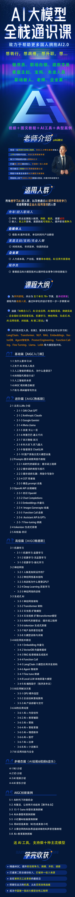
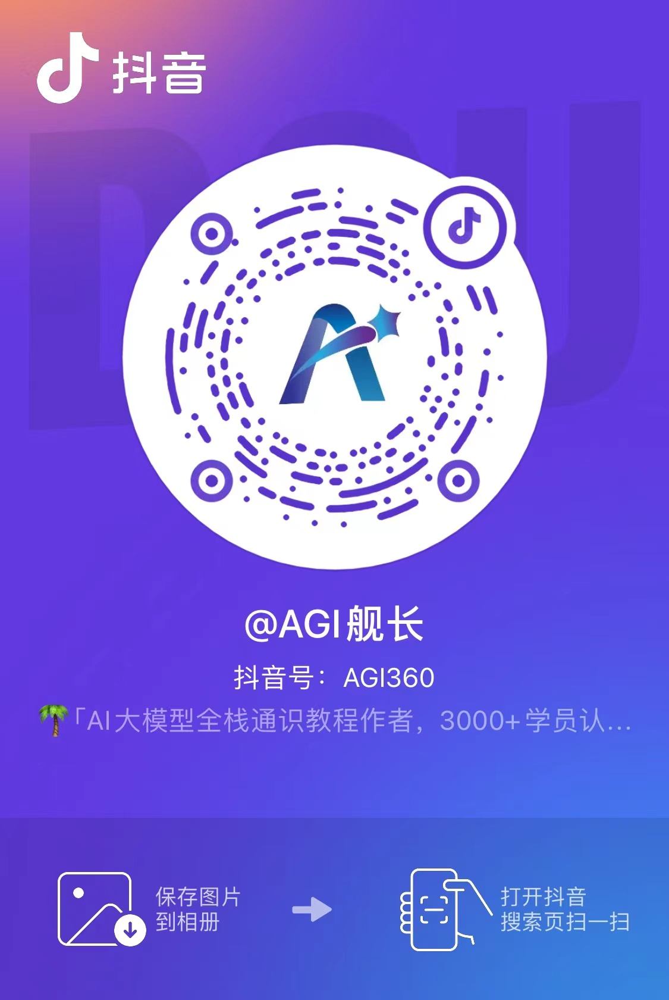

# AIClass-notes
 AI大模型全栈通识课件

## 介绍
本项目为【[AI大模型全栈通识课堂](https://www.yuque.com/lhyyh/agi/introduce)】的课件资料，含有课堂演示的全部源码。

## 涉及内容
- OpenAI 编程
- NLP 编程
- Tencent VDB 编程
- Fine-Tune
- 以及一些其他 tools

## 使用 pip 进行安装模块
```shell
# 安装虚拟环境
python3 -m venv venv

# 激活并安装依赖
source venv/bin/activate

# 如果镜像安装有问题，可以 pip config list 查看镜像源（能看到 pip.conf）

# 如果报错较多，就升级一下 pip 版本，pip3 install --upgrade pip

pip3 install -r requirements.txt
```

## 使用说明

#### 【1】环境变量配置
重命名`.env.templet`为`.env`，并填写以下内容：

|变量名称| 变量含义                  | 说明                   |
|---|-----------------------|----------------------|
|OPENAI_API_KEY| 你的 openai 的 api-Key   | 如果非官方 key，需要配置代理地址   |
|OPENAI_BASE_URL| 你的 openai 代理地址        | 如果没有可私信我微信 `LHYYH0001` |
|AZURE_API_KEY| azure openai key      |  |
|AZURE_BASE_URL| azure openai base url ||
|AZURE_API_VERSION| 版本                    |  |
|VDB_URL| 你的腾讯云向量数据库地址          |  |
|VDB_USER| 你的腾讯云向量数据库用户名         |  |
|VDB_KEY| 你的腾讯云向量数据库key         |  |
|ERNIE_CLIENT_ID| 你的qianfan_ak         |  |
|ERNIE_CLIENT_SECRET| 你的qianfan_sk         |  |
|TONGYI_KEY| 你的通义千问的 key         |  |

#### 【2】代理服务说明
如果你需要国内可访问的稳定的企业转发key，支持海量模型代理。可以与我联系：[LHYYH0001](https://www.yuque.com/lhyyh/ai/readme)

## AI 大模型全栈学习手册及工具

- 国内永久免费使用ChatGPT网站
    - https://www.jsbcp-2.top/

- AI 大模型全栈通识课介绍
    - https://www.yuque.com/lhyyh/agi/introduce

- AGI舰长个人简介
    - https://www.yuque.com/lhyyh/ai/readme

# AI大模型全栈通识课

如果你觉得我的分享对比有帮助，也欢迎加入我们交流社群，每天都有很多关于 ChatGPT、人工智能 AI、Python、变现创业的相关分享。
[点我查看社群介绍](https://mp.weixin.qq.com/s/7rEZNtEPSdtwySki_pvPDw)

<div style="text-align:center">
    
</div>

# ✅ 联系我
## AI全栈微信群
<div style="text-align:center">
   
</div>

## 个人微信
<div style="text-align:center">
    
</div>

## 抖音号
<div style="text-align:center">
    
</div>

## 微信公众号
<div style="text-align:center">
    
</div>

# 赞助

***
如果你觉得这个项目对你有帮助，并且情况允许的话，可以给我一点点支持，总之非常感谢支持～

## 微信
<div style="text-align:center">
    
</div>

## 支付宝
<div style="text-align:center">
    
</div>
